# Generation
## Preparation
### Get a Assignment sample and Set **Track Change**;
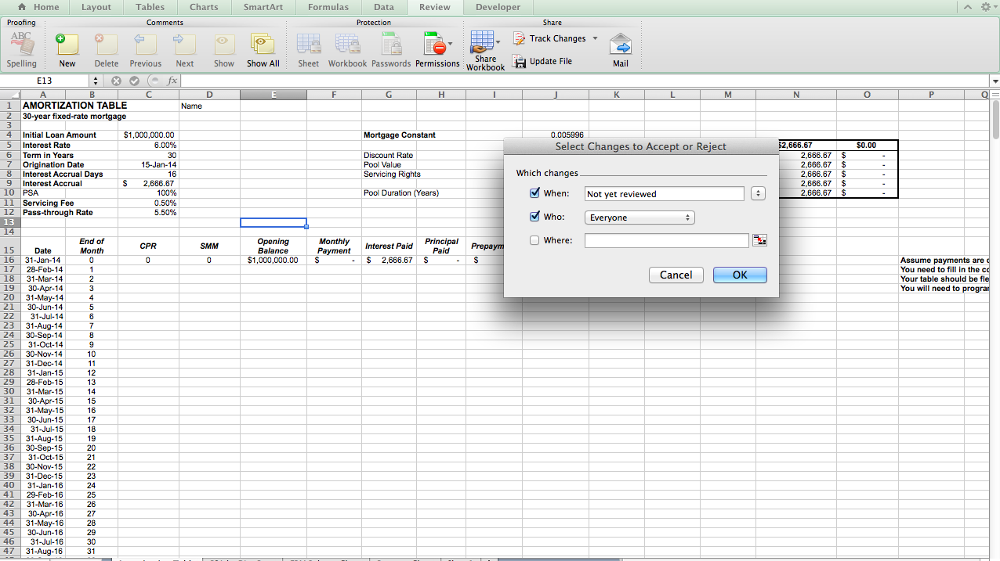
### Download the roster from Angel;
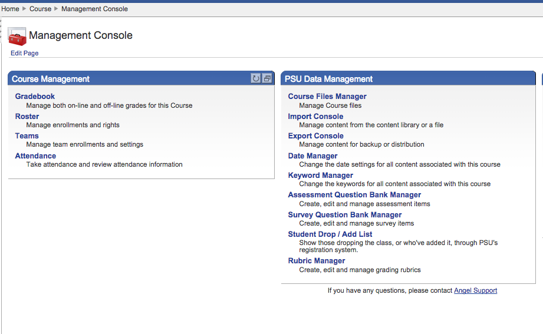
### Create a Folder 'Assignment';
## Run Excel Generator
### Choose the Assignment Template, Assignment Folder
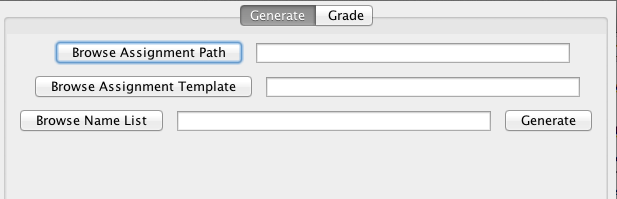
### Click Generate

# Grade
## Preparation 
### Put All the students homework(.xlsx) in one folder;
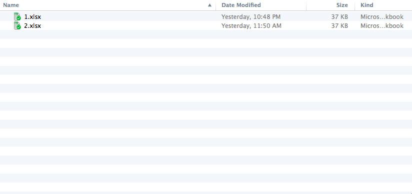
### Get a Answer Template which is the same as the Assignment and put the correct answer in Numeric Value or Formula inside each cell;
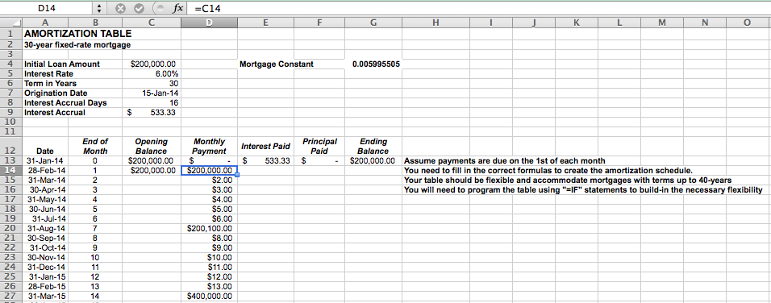
### Create Folder 'After' and 'Report' under the same folder with the 'Assignment' Folder;
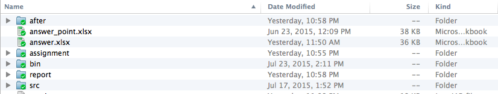
### Use the same template to set points for each cell. This is optional and it supports to find all errors in the students' assignments;
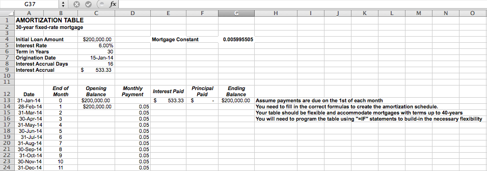

## Run Excel Grader
### Choose the Assignment Folder, Answer File and the optinal Score file;
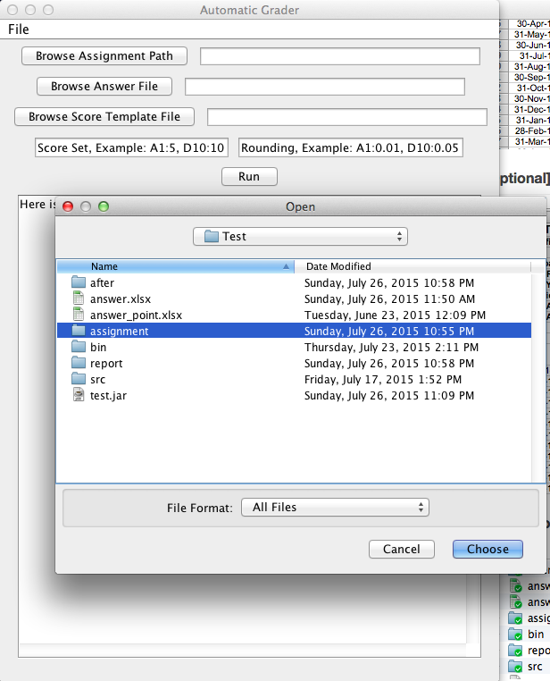
### Set Score and Rounding following the examples. In the score set box, the score set for each cell in separated by ',' and 'A1:5' means the score for A1 is 5pt while the total score is 100. In the rounding set box, 'A1:0.01' means the answer will be correct if it is in the range [answer-0.01, answer+0.01].
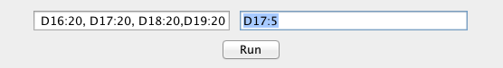
### Click Run 

## Outputs
### Report in the User Interface;
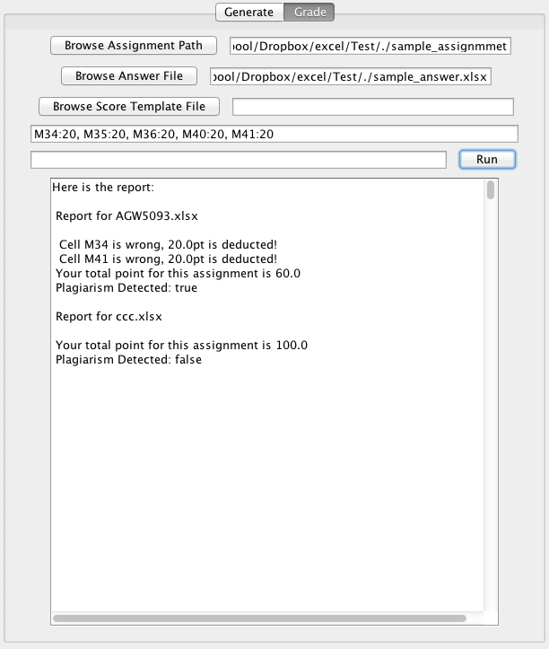
### Report for each student in the Report Folder. Only the cell settled score will be presented in the report;
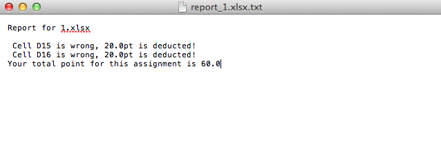
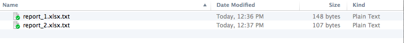
### Incorrect cell marked in the after Folder. All the mistake cells will be marked;
 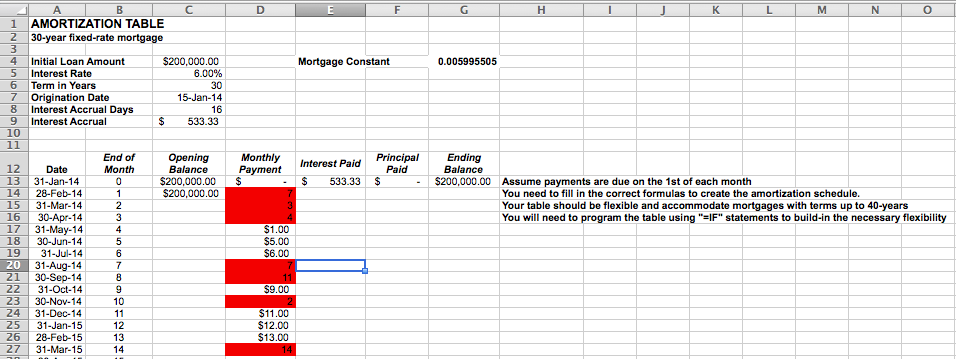
 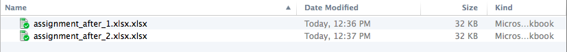
 
### Plagiarism Detection
 
#### Hidden Watermark Check (Directly displayed in the report, false means plagiarism detected);
#### Track Change History is shown when you check respectively in the assignment file.
 
 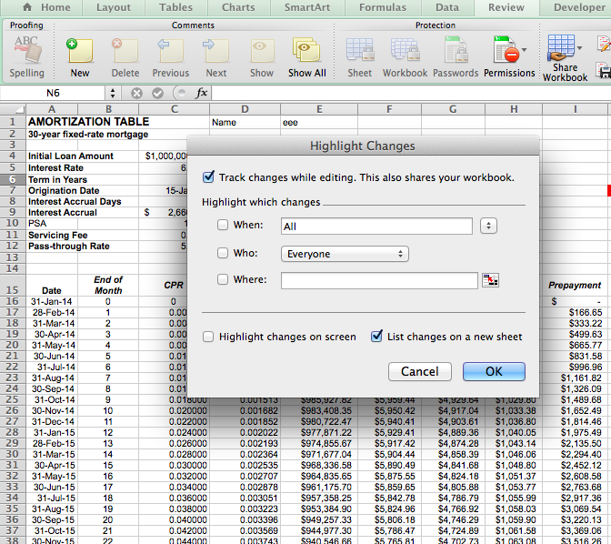  
 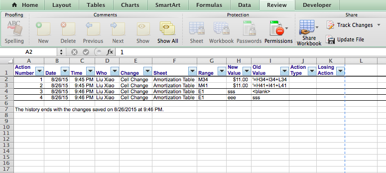 

